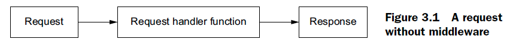
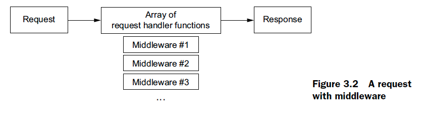
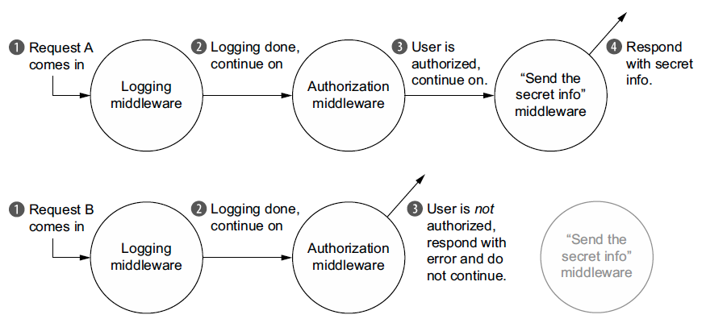

# Learning Express.js

[//]: # (TODO: Add a project description)

## Express Basics
At a high level Express provides 4 main features:

- **Middleware**: In contrast to vanilla Node, where your requests flow through only
  one function, Express has a middleware stack, which is effectively an array of
  functions.
- **Routing**: Routing is a lot like middleware, but the functions are called only when
  you visit a specific URL with a specific HTTP method. For example, you could only
  run a request handler when the browser visits yourwebsite.com/about.
- **Extensions to request and response objects**: Express extends the request and response
  objects with extra methods and properties for developer convenience.
- **Views**: Views allow you to dynamically render HTML. This both allows you to
  change the HTML on the fly and to write the HTML in other languages.

### Middleware
In Node’s HTTP server, every request goes through one big function. This looks like
the following listing.

With middleware, rather than having your request pass through one function you
write, it passes through an array of functions you write called a middleware stack. It
might look like figure 3.2.

**Example of request flow with middleware**

When a request comes in, it will always go through the middleware in the **same order
in which you use them**

## Development
First you need to make a copy of the `.env.sample.local` file and rename it to `.env.local` and fill in the necessary values.

